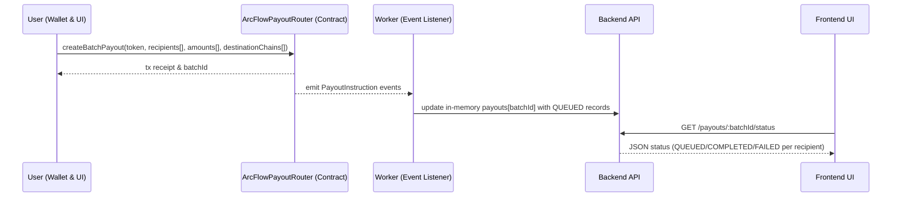

# System Architecture – ArcFlow Treasury

## Overview

ArcFlow Treasury is an Arc‑native treasury and payout orchestration system for USDC and EURC. It provides conditional escrow, programmable payroll/vesting streams, and multi‑recipient payout batches from a single stablecoin‑centric interface.

The system is composed of smart contracts deployed on Arc, a lightweight backend service for event processing and payout tracking, and a React-based frontend that acts as a treasury console. Arc is treated as the primary execution and state hub, while the backend is designed to integrate with Circle infrastructure for cross‑chain settlement in a production setting.

---

## Key Requirements

### Functional

- Support creation and management of USDC/EURC escrows with disputes and automatic release.
- Support creation and management of vesting streams for payroll/vesting use cases.
- Support creation and tracking of multi‑recipient payout batches.
- Provide a unified web UI for interacting with escrows, streams, and payouts.
- Expose an API for querying payout status by batch ID.
- Emit events suitable for integration with Circle Wallets, Gateway, and related services.

### Non‑functional

- **Performance:** Low latency for user interactions; rely on Arc’s fast finality for on‑chain operations.
- **Scalability:** Ability to handle increasing numbers of escrows, streams, and payout batches by horizontal scaling of backend/frontend and leveraging Arc’s scalability.
- **Reliability:** Event‑driven processing for payouts with clear status tracking.
- **Security:** Safe smart contract patterns, explicit permission checks, and stablecoin‑centric design.
- **Maintainability:** Clear separation of concerns between contracts, backend, and frontend; modular codebase.
- **Extensibility:** Straightforward path to integrate Circle APIs and additional policy/agent logic without restructuring the system.

---

## High‑Level Architecture

The system comprises three main layers:

- **On‑chain layer (Arc smart contracts)**  
  Implements core financial logic: escrow, vesting streams, and payout batches.

- **Backend layer (Node/Express + worker)**  
  Provides a small HTTP API for payout status and runs an event listener that subscribes to on‑chain payout events and maintains in‑memory state.

- **Frontend layer (React SPA)**  
  Provides a treasury console for users to manage escrows, streams, and payouts. It interacts directly with smart contracts via the user’s wallet and with the backend via HTTP.

### System Context / Container Diagram

```mermaid
flowchart LR
  User[User Wallet & Browser] --> UI[ArcFlow Treasury UI<br/>(React SPA)]
  UI -->|EVM tx & calls via wallet| Contracts[Arc Smart Contracts<br/>ArcFlowEscrow / ArcFlowStreams / ArcFlowPayoutRouter]
  UI -->|HTTP (REST)| API[Backend API<br/>(Express)]
  Contracts -->|Events: PayoutInstruction| Worker[Event Listener Worker<br/>(Node + ethers)]
  Worker -->|Update payout state| API
  API -->|Future: USDC transfers| Circle[Circle Wallets / Gateway<br/>(External Services)]
```

This diagram shows the main containers and their interactions. The user interacts with the UI, which uses their wallet to call Arc smart contracts. The backend API is queried by the UI for payout status, and a worker process listens to contract events to maintain payout state, which can be used to drive Circle‑based transfers in a full deployment.

---

## Component Details

### 1. Web Client – ArcFlow Treasury UI (React SPA)

**Responsibilities**

- Provide user interface for:
  - Creating and managing escrows.
  - Creating and managing vesting streams.
  - Creating and monitoring payout batches.
- Connect to Arc via injected wallet (e.g. MetaMask) for signed transactions.
- Connect to backend HTTP API to retrieve payout status and system health.

**Main Technologies**

- React
- Vite
- TypeScript
- ethers v6

**Key Data**

- Contract addresses and ABI definitions.
- User input for escrows (payee, amount, expiry, arbitrator).
- User input for streams (employee, amount, timing).
- User input for payout batches (recipients, amounts, destination chains).
- Local state for last created IDs, cached statuses, and basic metrics.

**Communication**

- **To Contracts:** via wallet provider using ethers; sends transactions and performs read calls.
- **To Backend:** HTTP requests to `GET /status` and `GET /payouts/:batchId/status`.

---

### 2. Arc Smart Contracts

#### 2.1 ArcFlowEscrow

**Responsibilities**

- Lock USDC/EURC in escrow on Arc.
- Track escrow lifecycle: creation, dispute, resolution, and automatic release.
- Apply protocol fee logic for payouts to an on‑chain fee collector.

**Main Technologies**

- Solidity 0.8.x
- Deployed on Arc (EVM chain)

**Key Data**

- `Escrow` struct:
  - `payer`, `payee`
  - `token`
  - `amount`
  - `expiry`
  - `arbitrator`
  - `disputed`, `released`, `refunded`
- Global configuration:
  - `feeCollector`
  - `feeBps` (basis points)

**Communication**

- Called by the frontend via the user’s wallet.
- Emits events (`EscrowCreated`, `EscrowDisputed`, `EscrowResolved`, `EscrowReleased`, `EscrowRefunded`) for monitoring and analytics (not strictly used by backend in MVP).

---

#### 2.2 ArcFlowStreams

**Responsibilities**

- Represent employer‑funded vesting streams.
- Compute vested amounts over time.
- Handle employee withdrawals of vested funds.
- Allow employer to revoke streams while fairly splitting vested vs unvested funds.

**Main Technologies**

- Solidity 0.8.x
- Deployed on Arc

**Key Data**

- `Stream` struct:
  - `employer`, `employee`
  - `token`
  - `totalAmount`
  - `start`, `cliff`, `end`
  - `withdrawn`

**Communication**

- Called by the frontend via the user’s wallet.
- Emits `StreamCreated`, `Withdrawn`, and `Revoked` events for monitoring.

---

#### 2.3 ArcFlowPayoutRouter

**Responsibilities**

- Accept and store batch payout definitions.
- Deduct total funds from the creator’s wallet.
- Emit granular `PayoutInstruction` events for off‑chain processing.

**Main Technologies**

- Solidity 0.8.x
- Deployed on Arc

**Key Data**

- `Batch` struct:
  - `creator`
  - `token`
  - `totalAmount`
  - `createdAt`

**Communication**

- Called by the frontend via the user’s wallet to create batches.
- Emits:
  - `BatchCreated(batchId, creator, token, totalAmount)`
  - `PayoutInstruction(batchId, index, recipient, amount, destinationChain)`
- These events are consumed by the backend worker.

---

### 3. Backend API (Express)

**Responsibilities**

- Expose a small REST API for frontend consumption:
  - `GET /status` – health and network information.
  - `GET /payouts/:batchId/status` – payout status for a batch.
  - `POST /webhook/circle` – webhook endpoint for future Circle integration.
- Maintain in‑memory state of payouts populated by the worker.

**Main Technologies**

- Node.js
- Express
- TypeScript
- ethers v6 (for type sharing and potential additional reads)

**Key Data**

- In‑memory map: `payouts[batchId] = PayoutRecord[]`, where each record includes:
  - `batchId`
  - `index`
  - `recipient`
  - `amount`
  - `destinationChain`
  - `status` (`QUEUED`, `COMPLETED`, `FAILED`)

**Communication**

- Receives requests from frontend over HTTP.
- Shares in‑memory data with the worker (same process space or shared module).

---

### 4. Event Listener Worker

**Responsibilities**

- Connect to Arc RPC.
- Subscribe to `PayoutInstruction` events from `ArcFlowPayoutRouter`.
- Populate and update payout records in the backend’s in‑memory store.
- In a future version, trigger Circle Wallets/Gateway calls and update statuses accordingly.

**Main Technologies**

- Node.js
- TypeScript
- ethers v6

**Key Data**

- Reads `ARC_RPC_URL` and `ARC_PAYOUT_ROUTER_ADDRESS` from configuration.
- Writes to shared `payouts` map in the backend module.

**Communication**

- Listens to on‑chain events via WebSocket or HTTP polling.
- Updates the in‑memory store used by the API server.
- In future, communicates with Circle APIs (HTTP).

---

### 5. External Integrations – Circle (Future)

**Responsibilities (planned)**

- Act as the real payout execution layer:
  - Circle Wallets: manage USDC balances across chains.
  - Circle Gateway/CCTP: perform cross‑chain bridging and payouts.
- Provide webhook events to confirm payout completion or failure.

**Main Technologies**

- Circle REST APIs
- `@circle-fin/developer-controlled-wallets` SDK (already listed as a dependency)
- Webhooks to the backend

**Circle integration status**

The Circle integration is currently a stub. Its design follows the patterns used in
`circlefin/arc-multichain-wallet` — same env variable names (`CIRCLE_API_KEY`,
`CIRCLE_ENTITY_SECRET`), same chain identifier strings (`ARC-TESTNET`, `BASE-SEPOLIA`,
`AVAX-FUJI`), same two-endpoint split (Wallets API for same-chain, Gateway API for
cross-chain), and the same CCTP domain IDs per chain. Moving to live payouts is
primarily a matter of replacing the stub fetch in `circleClient.createTransfer()` with
real API calls and adding EIP-712 BurnIntent signing for the Gateway cross-chain path.

**USYC note**: ArcFlow also supports USYC (Hashnote tokenized US Treasury yield token,
available on Arc at `usyc.dev.hashnote.com`). Holders can Subscribe to convert testnet
USDC → USYC and Redeem to convert back. USYC is a valid source token in `ArcFlowPayoutRouter`;
Circle's cross-chain settlement routes use USDC/EURC as the transfer asset.

**Communication**

- Outbound HTTP from backend/worker to Circle.
- Inbound HTTP from Circle to `POST /webhook/circle`.

---

## Data Flow

### Escrow Creation & Lifecycle

1. User opens the Escrow tab in the UI and fills in payee, amount, expiry, and arbitrator.
2. UI constructs a transaction to `ArcFlowEscrow.createEscrow` using the connected wallet.
3. ArcFlowEscrow:
   - Pulls `amount` of `token` from the payer (requires prior `approve`).
   - Stores escrow data and emits `EscrowCreated`.
4. UI fetches escrow details via `escrows(id)` and renders current status.
5. If a dispute arises, payer/payee calls `raiseDispute`.
6. Arbitrator calls `resolveDispute` to release to payee or refund payer.
7. If no dispute and expiry has passed, anyone can call `autoRelease` to release funds to payee.

This flow is entirely on‑chain; the backend is not involved.

---

### Vesting Stream Creation & Lifecycle

1. Employer opens the Payroll/Vesting tab and configures employee, amount, and time parameters.
2. UI calls `ArcFlowStreams.createStream` via the employer’s wallet.
3. ArcFlowStreams:
   - Pulls `totalAmount` from employer (requires prior `approve`).
   - Stores stream data and emits `StreamCreated`.
4. Employee, using their wallet, calls `getWithdrawable(id)` via the UI to see the vested amount.
5. Employee calls `withdraw(id)` to claim vested funds.
6. Employer can call `revoke(id)`:
   - Contract computes vested vs unvested.
   - Sends vested remainder to employee and refunds unvested to employer.
   - Emits `Revoked`.

Again, this flow is fully on‑chain and does not depend on backend services.

---

### Payout Batch Creation & Status Flow

#### Mermaid Sequence Diagram



**Flow description**

1. User defines one or more recipients in the UI and submits a batch payout.
2. UI calls `createBatchPayout` on `ArcFlowPayoutRouter` using the wallet:
   - Contract validates inputs.
   - Transfers the total amount from the creator to itself.
   - Emits `BatchCreated` and one `PayoutInstruction` per recipient.
3. Worker subscribes to `PayoutInstruction` events:
   - For each event, it appends a `PayoutRecord` to `payouts[batchId]` with status `QUEUED`.
4. UI periodically calls `GET /payouts/:batchId/status` on the backend:
   - Backend returns the current list of payouts and statuses.
5. In a future version:
   - Worker would initiate payouts via Circle APIs and update statuses based on responses/webhooks.

---

## Data Model (High‑Level)

This section describes high‑level entities; actual contract storage and JSON structures may differ.

### On‑chain Entities

- **Escrow**
  - `id: uint256`
  - `payer: address`
  - `payee: address`
  - `token: address`
  - `amount: uint256`
  - `expiry: uint256`
  - `arbitrator: address`
  - `disputed: bool`
  - `released: bool`
  - `refunded: bool`

- **Stream**
  - `id: uint256`
  - `employer: address`
  - `employee: address`
  - `token: address`
  - `totalAmount: uint256`
  - `start: uint256`
  - `cliff: uint256`
  - `end: uint256`
  - `withdrawn: uint256`

- **Batch**
  - `id: uint256`
  - `creator: address`
  - `token: address`
  - `totalAmount: uint256`
  - `createdAt: uint256`

### Off‑chain Entities

- **PayoutRecord**
  - `batchId: string`
  - `index: number`
  - `recipient: string`
  - `amount: string` (raw integer, e.g. 1e6 for 1.0 USDC)
  - `destinationChain: string` (label from event)
  - `status: "QUEUED" | "COMPLETED" | "FAILED"`

Relationships:

- An `Escrow` links a payer and payee for a specific token amount.
- A `Stream` links an employer and employee for a vested amount of a token.
- A `Batch` is associated with multiple `PayoutRecord` entries off‑chain, each representing a single recipient in a multi‑recipient payout.

---

## Infrastructure & Deployment

For the MVP, the system is designed to run in a simple, developer‑friendly setup. A production deployment can adapt this to managed infrastructure.

### Deployment Approach

- **Contracts:** Deployed via Hardhat to Arc testnet (and later mainnet).
- **Backend:** Node/Express server and worker, typically run as:
  - Two Node processes (API server, event worker), or
  - Two containers orchestrated by Docker Compose or a similar tool.
- **Frontend:** React/Vite SPA served via:
  - Vite dev server for development.
  - Static files on a CDN / static hosting service in production.

### Environments

- **Development:**
  - Local Node processes.
  - Arc testnet RPC endpoint.
  - Hot‑reloading for frontend and backend.
- **Staging / Test (optional):**
  - Same as development but with hosted API and UI.
  - Dedicated Arc testnet contracts.
- **Production:**
  - Hosted static frontend.
  - Hosted backend API and worker processes.
  - Contracts deployed to Arc mainnet (once ready).

Configuration is managed via environment variables in each component.

---

## Scalability & Reliability

### Scalability

- **Smart Contracts:**
  - Scale with Arc’s throughput and gas model. Designed to be minimal and stateless in execution (data stored on chain).
- **Backend:**
  - Stateless API server except for in‑memory payout store in MVP.
  - Can be scaled horizontally with a centralised store (e.g. database or cache) replacing in‑memory structures.
- **Frontend:**
  - Static assets; trivially scalable via CDNs.

### Reliability

- **Event‑driven payouts:**
  - Payout tracking is driven by on‑chain events; the worker can be restarted and resynchronised if a persistent store is used.
- **Failure modes:**
  - If the backend goes down, on‑chain operations continue to function; only payout status tracking is affected.
  - If the worker is down, new payout events are not captured until it restarts; historical events could be replayed if necessary (future improvement).

---

## Security & Compliance

### Smart Contract Security

- Use of Solidity 0.8.x with built‑in overflow checks.
- Explicit validation of critical inputs (non‑zero addresses, non‑zero amounts, array length checks).
- Simple control flows without complex external calls, reducing reentrancy risk.
- Fee logic centralised in `_payout` helper for escrow.

### Backend & API Security

- No user authentication in MVP (intended for demo and testnet use).
- In production:
  - API should be protected with authentication and authorisation (e.g. API keys, OAuth2).
  - Rate limiting and input validation should be added.
- Secrets (RPC URLs, private keys, Circle API keys) stored in environment variables; in production, use a proper secrets manager.

### Compliance & Data Protection

- The system primarily processes blockchain addresses and payout metadata; there is no explicit PII in the MVP.
- For production use, any PII or sensitive metadata must be stored and handled in line with applicable regulations (e.g. GDPR), and Circle integration may impose additional compliance constraints.

---

## Observability

### Logging

- Backend logs:
  - API requests (optionally).
  - Event listener activity (PayoutInstruction events).
  - Errors and exceptions.
- For production, logs should be centralised and aggregated.

### Metrics

- Potential metrics:
  - Number of escrows created (from events).
  - Number of active streams.
  - Number of payout batches and payouts by status.
- Not implemented in MVP, but the architecture supports adding metrics collection without major changes.

### Tracing

- Not implemented in MVP.
- A production system could use distributed tracing tools to monitor calls from UI → backend → Circle.

---

## Trade‑offs & Design Decisions

- **Arc as a single hub:**  
  The system assumes Arc as the primary hub for all treasury state and execution, simplifying cross‑chain concerns. Trade‑off: requires bridging in/out for other ecosystems, handled via Circle rather than direct multi‑chain contracts.

- **Event‑driven payouts vs on‑chain execution:**  
  Batch payouts are not settled fully on‑chain; instead, events instruct an off‑chain worker. This makes integration with Circle and traditional finance tooling easier but introduces off‑chain components that must be secured and monitored.

- **In‑memory payout store in MVP:**  
  Chosen for simplicity and hackathon speed. Trade‑off: no persistence across restarts; not suitable for production.

- **No on‑chain indexing for dashboard:**  
  The dashboard relies on client‑side reads and simple tracking of IDs rather than a full indexing solution. This keeps the stack lean but limits analytics depth.

---

## Future Improvements

- **Persistent Storage for Payouts:**
  - Replace in‑memory `payouts` map with a persistent data store (e.g. PostgreSQL, Redis, or a document database).
  - Enable replays and robust recovery.

- **Circle Integration:**
  - Implement actual payout calls via Circle Wallets and Gateway.
  - Store Circle transaction IDs and map them to `PayoutRecord`s.
  - Use Circle webhooks to update statuses.

- **Policy Engine:**
  - Add server‑side rules for minimum batch size, scheduling, and approval flows.
  - Integrate agent logic to automatically trigger or delay batches based on treasury conditions.

- **Role‑based Access:**
  - Introduce an organisational model with admins, finance operators, and read‑only roles.
  - Map roles to wallets or account systems.

- **Enhanced Observability:**
  - Add structured logging, metrics, and dashboards.
  - Implement basic alerting for failed payouts or high error rates.

- **Expanded Token Support and FX:**
  - Integrate USYC and StableFX to manage yield and FX‑aware payouts.
  - Extend UI to show reserves, yields, and FX breakdowns.

- **Security Hardening:**
  - Formal audits of smart contracts.
  - Hardened API with authentication, rate limiting, and penetration testing.

These improvements can be layered on top of the current architecture without substantial redesign, reflecting the system’s goal of being both practical today and extensible for production‑grade deployments.
