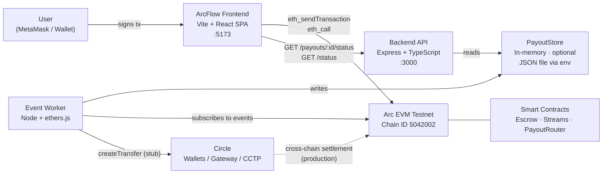
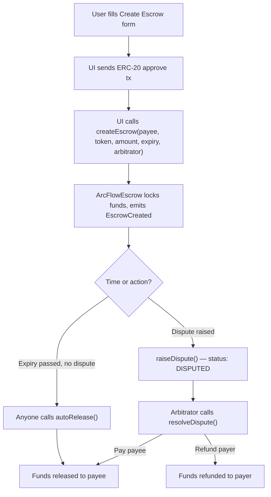
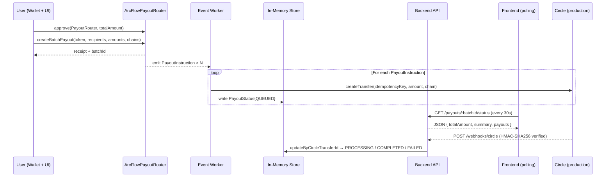

# System Architecture – ArcFlow Treasury

## Overview

ArcFlow Treasury is an Arc-native treasury and payout orchestration system for USDC and EURC. It provides conditional escrow with dispute resolution, programmable payroll vesting streams, and multi-recipient batch payouts from a single stablecoin-centric web interface. Arc is treated as the primary execution and state hub — all financial logic runs on-chain, providing full auditability and immutability. The backend exists solely to listen for payout events and track their off-chain settlement progress via Circle.

The system is composed of three distinct layers: Solidity smart contracts deployed on Arc, a lightweight Node/Express backend that processes on-chain events and exposes a REST status API, and a React SPA that serves as the treasury console. The design intentionally keeps the frontend stateless with respect to on-chain data (all reads go through the user's wallet), while the backend handles asynchronous Circle-based settlement tracking. This separation allows each layer to evolve independently as the integration matures towards production.

---

## Key Requirements

### Functional

- Create and manage USDC/EURC escrows with configurable expiry, optional arbitrator, dispute raising, and auto-release.
- Create and manage linear vesting streams with cliff support; employees withdraw on demand, employers can revoke with a fair split.
- Create multi-recipient payout batches in a single transaction; each recipient specifies a destination chain.
- Provide a unified treasury dashboard showing obligations locked in escrows, streams, and pending batches.
- Persist a "My Escrows / Streams / Batches" list per user session so items survive page refresh (localStorage).
- Expose a REST API for querying payout batch status by ID, driven by on-chain `PayoutInstruction` events.
- Route off-chain payout settlement through Circle Wallets API (same-chain) and Circle Gateway/CCTP (cross-chain).

### Non-Functional

- **Performance:** Sub-second UI interactions; rely on Arc's fast finality for on-chain state.
- **Correctness:** Solidity 0.8.x with explicit overflow protection; all critical inputs validated on-chain.
- **Reliability:** Event-driven payout tracking; backend can be restarted and re-synced from chain history.
- **Security:** No private keys in frontend; secrets in environment variables; 2-step confirmation for destructive UI actions.
- **Maintainability:** Clear separation of concerns — contracts, backend, and frontend are independently testable.
- **Extensibility:** Straightforward path from stub Circle integration to live payouts without structural changes.

---

## High-Level Architecture

The system is built around three main layers that communicate through two interfaces: wallet-mediated on-chain calls from the frontend to contracts, and HTTP REST calls from the frontend to the backend.

- **On-chain layer** — Three Solidity contracts on Arc implement all financial logic. The frontend calls them directly through the user's injected wallet; no server-side signing occurs.
- **Backend layer** — A Node/Express server runs alongside an event listener worker. The worker subscribes to `PayoutInstruction` events from `ArcFlowPayoutRouter` and maintains an in-memory payout status store. The Express API exposes this store over HTTP.
- **Frontend layer** — A Vite + React SPA provides the treasury console. It calls contracts via ethers.js, queries the backend API for payout status, and persists session state in `localStorage`.

### System Context Diagram



The user interacts solely with the frontend, which fans out to Arc (via wallet) and the backend API (via HTTP). The backend worker runs independently, consuming events from Arc and driving Circle-based off-chain settlement. Dashed arrows indicate a production path not yet active in the MVP.

---

## Component Details

### 1. ArcFlow Frontend (React SPA)

**Responsibilities**

- Provide four pages: Dashboard, Escrow & Disputes, Payroll & Vesting, Payout Batches.
- Connect to Arc via injected wallet (MetaMask) using ethers.js v6 for transaction signing and contract reads.
- Poll `GET /payouts/:batchId/status` on the backend for payout tracking.
- Poll `GET /status` every 30 seconds for API health display in the topbar.
- Persist created item IDs in `localStorage` (`arcflow_my_escrows`, `arcflow_my_streams`, `arcflow_my_batches`) so list views survive refresh.
- Provide loading skeletons, empty states, error states, and toast notifications for all async operations.
- Enforce 2-step confirmation for destructive actions (raise dispute, revoke stream).

**Technologies**

| Tool | Role |
|---|---|
| Vite 7 + React 18 | SPA framework and dev server |
| TypeScript 5.x | Type safety |
| Tailwind CSS 3.x | Utility-first styling with glassmorphism design system |
| react-router-dom v6 | Client-side routing (SPA navigation, no page reloads) |
| ethers.js v6 | Wallet integration and contract calls |
| react-hot-toast | Toast notification system |
| lucide-react | Icon library |

**Key Data**

- Contract ABIs and deployed addresses (from environment variables).
- User form state for escrow, stream, and batch creation.
- `localStorage` lists: `MyEscrow[]`, `MyStream[]`, `MyBatch[]`.
- Fetched payout batch status from the backend API.

**Communication**

- → **Arc contracts:** `eth_sendTransaction` (writes), `eth_call` (reads) via MetaMask.
- → **Backend API:** `fetch` to `GET /status` and `GET /payouts/:batchId/status`.

---

### 2. Arc Smart Contracts

All three contracts are written in Solidity 0.8.20, use OpenZeppelin 5.x libraries, and are deployed on Arc (Chain ID 5042002). They are called directly by the frontend; the backend only reads their events.

#### 2.1 ArcFlowEscrow

**Responsibilities**

- Lock USDC/EURC in escrow between a payer and payee.
- Track the full escrow lifecycle: creation → dispute → resolution or auto-release.
- Apply a configurable protocol fee (basis points) on payout.

**Key Data**

```
Escrow {
  payer, payee: address
  token: address           // USDC or EURC
  amount: uint256
  expiry: uint256          // Unix timestamp
  arbitrator: address
  disputed, released, refunded: bool
}
feeCollector: address
feeBps: uint256
```

**Events emitted:** `EscrowCreated`, `EscrowDisputed`, `EscrowResolved`, `EscrowReleased`, `EscrowRefunded`

---

#### 2.2 ArcFlowStreams

**Responsibilities**

- Hold employer-funded linear vesting streams with an optional cliff period.
- Compute vested amount on demand: linear interpolation between cliff and end.
- Allow employee to withdraw vested-but-not-withdrawn tokens at any time.
- Allow employer to revoke: vested portion goes to employee, remainder refunded.

**Key Data**

```
Stream {
  employer, employee: address
  token: address
  totalAmount, withdrawn: uint256
  start, cliff, end: uint256    // Unix timestamps
}
```

**Events emitted:** `StreamCreated`, `Withdrawn`, `Revoked`

---

#### 2.3 ArcFlowPayoutRouter

**Responsibilities**

- Accept batch payout definitions and lock total funds.
- Emit one `PayoutInstruction` event per recipient — the primary trigger for off-chain settlement.
- Store batch metadata for on-chain reference.

**Key Data**

```
Batch {
  creator: address
  token: address
  totalAmount: uint256
  createdAt: uint256
}
```

**Events emitted:**
- `BatchCreated(batchId, creator, token, totalAmount)`
- `PayoutInstruction(batchId, index, recipient, amount, destinationChain)` — one per recipient

**Note:** `destinationChain` is a `bytes32` label (e.g. `BASE`, `AVAX`). The backend maps this to Circle's canonical chain identifiers.

---

### 3. Backend API (Express)

**Responsibilities**

- Serve `GET /status` — health and network metadata.
- Serve `GET /payouts/:batchId/status` — aggregated payout status for a batch.
- Serve `GET /payouts/:batchId/:index/status` — status for a single recipient.
- Maintain an in-memory `Map<batchId, PayoutStatus[]>` populated by the worker.

**Technologies:** Node.js 18+, Express 4.x, TypeScript 5.x, Winston 3.x (structured logging)

**Key Data**

```typescript
PayoutStatus {
  batchId: string
  index: number
  recipient: string
  amount: string            // human-readable (e.g. "100.000000")
  destinationChain: string  // Circle chain name (e.g. "BASE-SEPOLIA")
  status: "QUEUED" | "PROCESSING" | "COMPLETED" | "FAILED"
  circleTransferId?: string
  error?: string
  createdAt: Date
  updatedAt: Date
}
```

**Payout store: `PayoutStore`**

The payout store (`src/stores/payoutStore.ts`) supports optional JSON file persistence via an optional `filePath` constructor argument (set via `PAYOUT_STORE_PATH` env var). The constructor loads existing data synchronously at startup and rebuilds all secondary indexes; subsequent mutations schedule a 200 ms debounced async `writeFile`. Without a `filePath` the store is purely in-memory (default).

The store wraps three Maps with two secondary indexes:

| Structure | Key | Value | Purpose |
|---|---|---|---|
| `payouts` | `"${batchId}-${index}"` | `PayoutStatus` | Primary store |
| `batchIndex` | `batchId` | `Set<compositeKey>` | O(k) batch retrieval |
| `transferIndex` | `circleTransferId` | `compositeKey` | O(1) webhook lookup |

`getBatch(batchId)` returns entries sorted ascending by `index`, guaranteeing deterministic API output regardless of event processing order.

**Batch summary arithmetic**

`GET /payouts/:batchId/status` uses `computeBatchSummary()` — a single pass over the payout array that:

1. Accumulates total as a `Number` integer (`Math.round(parseFloat(amount) × 10⁶)`) — no per-element BigInt allocation.
2. Converts to `BigInt` once at the end.
3. Formats with `formatMicro()` using integer division/modulo — no floating-point rounding.

This is 1.67× faster than 5 separate `filter`/`reduce` passes and exact for totals up to ~9 × 10⁹ USDC.

**Communication**

- ← Frontend: HTTP GET requests for `/status`, `/payouts/:batchId/status`, `/payouts/:batchId/:index/status`
- ← Circle: `POST /webhooks/circle` (HMAC-SHA256 verified) for transfer status callbacks
- ↔ Worker: shared `PayoutStore` instance (same process when running `dev:server`)

---

### 4. Event Listener Worker

**Responsibilities**

- Connect to Arc RPC via ethers.js `JsonRpcProvider`.
- Subscribe to past and future `PayoutInstruction` events from `ArcFlowPayoutRouter`.
- For each event:
  - Decode event parameters.
  - Map `bytes32` chain label to Circle chain identifier (e.g. `BASE` → `BASE-SEPOLIA`).
  - Format amount from wei to human-readable USDC/EURC.
  - Generate an idempotency key (`arcflow_{batchId}-{index}_{txHash}`).
  - Call `circleClient.createTransfer()`.
  - Write `PayoutStatus` record with `QUEUED` status.

**Technologies:** Node.js 18+, TypeScript 5.x, ethers.js v6, Winston 3.x

**Chain identifier mapping**

| Contract `bytes32` | Circle chain name | CCTP domain ID |
|---|---|---|
| `ARC` | `ARC-TESTNET` | 5 |
| `BASE` | `BASE-SEPOLIA` | 6 |
| `AVAX` / `AVALANCHE` | `AVAX-FUJI` | 1 |
| `ETH` / `ETHEREUM` | `ETH-SEPOLIA` | 0 |
| `ARB` / `ARBITRUM` | `ARB-SEPOLIA` | 3 |
| (unknown) | `ARC-TESTNET` | 5 (fallback) |

---

### 5. Circle Integration (Stub → Production)

**Responsibilities (planned)**

- **Same-chain payouts:** Circle Wallets API (`api.circle.com/v1/transfers`) — used when source and destination chains match.
- **Cross-chain payouts:** Circle Gateway API (`gateway-api-testnet.circle.com/v1/transfer`) with CCTP burn-attest-mint — used when chains differ.
- **Status updates:** Circle posts real-time callbacks to `POST /webhooks/circle`, verified with HMAC-SHA256.

**Current status:** Same-chain payouts are **live** when `CIRCLE_API_KEY` is set — `circleClient.createTransfer()` calls the Circle Wallets API (`api.circle.com/v1/w3s/wallets/{walletId}/transfers`) with real HTTP, using `CIRCLE_WALLET_ID` as the source wallet. Cross-chain payouts (non-ARC destinations) still stub and log a warn; completing them requires:

1. EIP-712 `BurnIntent` signing (reference: `arc-multichain-wallet/lib/circle/gateway-sdk.ts → transferGatewayBalanceWithEOA`).
2. CCTP attestation polling before the mint on the destination chain.

Without `CIRCLE_API_KEY` the client operates in stub mode (logged, returns a fake ID) — the safe default for local development.

The `POST /webhooks/circle` webhook handler is **already implemented** — it verifies the `x-circle-signature` HMAC-SHA256 header, maps Circle statuses (`pending → PROCESSING`, `complete → COMPLETED`, `failed → FAILED`), and updates `PayoutStore` via `updateByCircleTransferId()`.

**USYC note:** `ArcFlowPayoutRouter` accepts USYC (Hashnote tokenised US Treasury yield token, available on Arc at `usyc.dev.hashnote.com`) as a source token. Circle's cross-chain routes use USDC/EURC as the settlement asset.

---

## Data Flow

### Escrow Lifecycle



This flow is entirely on-chain; the backend is not involved. The UI reads escrow state directly from the contract.

---

### Payout Batch Creation & Status Flow



The user submits a batch transaction; the contract emits one event per recipient. The worker processes events independently of the frontend. The frontend polls the backend API for status without re-querying the chain.

---

## Data Model (High-Level)

### On-Chain Entities

```
Escrow
  id            uint256        Auto-incremented
  payer         address
  payee         address
  token         address        USDC or EURC contract
  amount        uint256        Token units (6 decimals for USDC/EURC)
  expiry        uint256        Unix timestamp
  arbitrator    address        Zero if not set
  disputed      bool
  released      bool
  refunded      bool

Stream
  id            uint256
  employer      address
  employee      address
  token         address
  totalAmount   uint256
  start         uint256        Vesting start timestamp
  cliff         uint256        Cliff timestamp (no withdrawal before this)
  end           uint256        Full vest timestamp
  withdrawn     uint256        Cumulative withdrawn

Batch
  id            uint256
  creator       address
  token         address
  totalAmount   uint256
  createdAt     uint256
  ↳ PayoutInstruction events (one per recipient, not stored in struct)
```

### Off-Chain Entities (In-Memory)

```
PayoutStatus
  batchId           string
  index             number
  recipient         string     EVM address
  amount            string     Human-readable 6-decimal (e.g. "100.000000")
  destinationChain  string     Circle chain name (e.g. "BASE-SEPOLIA")
  status            enum       QUEUED | PROCESSING | COMPLETED | FAILED
  circleTransferId  string?    Set after Circle accepts the transfer
  error             string?    Set on FAILED payouts
  createdAt         Date
  updatedAt         Date
```

### Session-Persistent Entities (localStorage)

```
MyEscrow   { id, payee, amount, token, createdAt }
MyStream   { id, employee, amount, token, createdAt }
MyBatch    { id, recipients, total, token, createdAt }
```

Stored under keys `arcflow_my_escrows`, `arcflow_my_streams`, `arcflow_my_batches`. These are UI-only; they do not reflect on-chain state.

---

## Infrastructure & Deployment

### MVP (Local / Hackathon)

```
[localhost:5173]  Vite dev server — React SPA
[localhost:3000]  Node/Express API + Event Worker (same process via dev:server)
[Arc Testnet]     Public RPC endpoint — no local node required
```

Both backend processes can run in a single Node process (`npm run dev:server`) which starts the Express server and attaches the worker, or as separate processes (`dev:server` + `dev:worker`) for isolation.

### Production (Recommended Path)

```
┌────────────────────────────────────────────────────────┐
│  CDN / Static Host  (e.g. Vercel, Cloudflare Pages)    │
│  └─ React SPA (dist/)                                  │
└────────────────────────────────────────────────────────┘
        │ HTTPS                         │ HTTPS
        ▼                               ▼
┌─────────────────────┐     ┌─────────────────────────┐
│  API Server         │     │  Event Worker            │
│  Node + Express     │◄────│  Node + ethers           │
│  (horizontally      │     │  (single instance,       │
│   scalable)         │     │   restartable)           │
└─────────┬───────────┘     └──────────┬──────────────┘
          │                            │
          ▼                            ▼
┌──────────────────────────────────────────────────────┐
│  PostgreSQL / Redis (replaces in-memory store)       │
└──────────────────────────────────────────────────────┘
          │                            │
          ▼                            ▼
┌──────────────────┐       ┌─────────────────────────┐
│  Arc Mainnet     │       │  Circle Wallets/Gateway  │
└──────────────────┘       └─────────────────────────┘
```

### Environments

| Environment | Contracts | Backend | Frontend | Circle |
|---|---|---|---|---|
| **Development** | Arc Testnet | `localhost:3000` | `localhost:5173` | Stub |
| **Staging** | Arc Testnet | Hosted (e.g. Railway) | Hosted | Testnet credentials |
| **Production** | Arc Mainnet | Hosted (scaled) | CDN | Mainnet credentials |

---

## Scalability & Reliability

### Scalability

- **Contracts:** Scale with Arc's throughput. Stateless execution; all state on-chain.
- **Backend API:** Stateless except for in-memory payout store. Horizontal scaling is straightforward once the store is moved to a shared database.
- **Worker:** Intended as a single-instance process per deployment (event ordering must be preserved). Can be made redundant with leader election.
- **Frontend:** Static assets; trivially scaled via CDN.

### Reliability

- **On-chain operations are unaffected by backend downtime.** Users can continue creating escrows, streams, and batches even if the backend is unavailable.
- **Worker recovery:** Because `PayoutInstruction` events are permanently on Arc, a restarted worker can replay events from a historical block and reconstruct payout state. This requires a persistent store (future improvement).
- **Idempotency keys** (`arcflow_{batchId}-{index}_{txHash}`) prevent duplicate Circle transfers if the worker processes the same event twice.
- **Payout status polling** in the frontend uses a 30-second interval with an explicit "Refresh" button, providing predictable load on the backend.

---

## Security & Compliance

### Smart Contract Security

- Solidity 0.8.x built-in arithmetic overflow protection.
- Explicit validation: non-zero addresses, non-zero amounts, array-length equality checks.
- No external calls within `createEscrow` or `createStream` (only `safeTransferFrom`/`safeTransfer` via OpenZeppelin).
- Protocol fee centralised in a single `_payout` helper to avoid duplication.
- Tests cover edge cases: zero address, zero amount, wrong caller, double-action reverts.

### Backend & API Security

- **Circle webhook HMAC:** The `POST /webhooks/circle` endpoint verifies `x-circle-signature` using `crypto.createHmac("sha256", CIRCLE_WEBHOOK_SECRET)` and `crypto.timingSafeEqual` to prevent both signature forgery and timing-based attacks. When `CIRCLE_WEBHOOK_SECRET` is unset the server warns and operates in stub mode (verification skipped).
- **Input validation:** `parseInt(index, 10)` with explicit radix and `isNaN` guard prevents NaN injection into payout index lookups. Payout index values exceeding `Number.MAX_SAFE_INTEGER` are rejected before `Number()` conversion to avoid precision loss.
- No authentication or rate limiting in MVP (demo/testnet scope).
- Production hardening required:
  - API key or OAuth2 authentication on all non-webhook endpoints.
  - Rate limiting (e.g. express-rate-limit).
  - Full input validation and sanitisation.
  - HTTPS-only with HSTS.
- Secrets (`ARC_PRIVATE_KEY`, `CIRCLE_API_KEY`, `CIRCLE_ENTITY_SECRET`, `CIRCLE_WEBHOOK_SECRET`) stored in environment variables. Production deployments should use a secrets manager (e.g. AWS Secrets Manager, HashiCorp Vault).

### Frontend Security

- No private keys handled in the browser; all signing is delegated to MetaMask.
- 2-step inline confirmation required for Raise Dispute and Revoke Stream (destructive, irreversible actions).
- No sensitive data stored in `localStorage` beyond item IDs and metadata.

### Compliance

- The MVP stores only blockchain addresses and payout metadata; no explicit PII.
- Production deployments may need to address AML/KYC obligations (depending on jurisdiction) and Circle's compliance requirements for developer-controlled wallets.
- GDPR considerations apply if user metadata is ever collected or persisted server-side.

---

## Observability

### Logging

- **Backend and Worker:** Winston 3.x structured logging (JSON in production, colourised in development).
- Log levels: `error`, `warn`, `info`, `debug` (configured via `LOG_LEVEL` env var).
- Log outputs:
  - Console (development): colourised, human-readable.
  - `combined.log`: all levels in JSON.
  - `error.log`: errors only in JSON.
- Logged events: API requests, `PayoutInstruction` processing, Circle call results, errors.

### Metrics

Not implemented in the MVP. The following metrics are recommended for production:

- Payout batch count and status distribution (QUEUED / COMPLETED / FAILED).
- Event processing latency (block event timestamp → backend write).
- API request rate and error rate per endpoint.
- Circle API call success/failure rate.

### Tracing

Not implemented in the MVP. In production, distributed tracing (e.g. OpenTelemetry → Jaeger / Datadog) would cover the path: frontend → backend API → Circle API.

---

## Trade-offs & Design Decisions

| Decision | Choice made | Trade-off |
|---|---|---|
| **Settlement model** | Off-chain event-driven via Circle (not fully on-chain) | Enables Circle integration and multi-chain routing; introduces backend dependency for payout tracking |
| **Payout store** | In-memory with optional JSON file persistence (`PAYOUT_STORE_PATH`) | File mode survives restarts and replays indexes on load; database (Postgres/Redis) is the next step for horizontal scaling |
| **Frontend data reads** | Direct from Arc via wallet (`eth_call`) | No indexer or subgraph needed; limits historical query capability |
| **Session state** | `localStorage` for My-list views | Survives refresh; not synced across devices or wallet changes |
| **Worker deployment** | Co-located with API server in MVP | Reduces ops complexity; single-instance limit must be addressed before scaling |
| **Circle routing** | Same-chain → Wallets API; cross-chain → Gateway/CCTP | Matches `arc-multichain-wallet` reference exactly; future-proof for mainnet with minimal changes |
| **Arc as primary hub** | All treasury state on Arc | Simplifies cross-chain concerns; users bridge in/out via Circle rather than managing liquidity |
| **Batch arithmetic** | `Number`-integer sum + single `BigInt` conversion | 1.67× faster than 5-pass float; exact for totals ≤ 9 × 10⁹ USDC; `Math.round` eliminates IEEE 754 drift |
| **PayoutStore indexing** | `batchIndex` + `transferIndex` secondary Maps | O(k)/O(1) vs O(n) scans; adds memory overhead proportional to store size (negligible for MVP scale) |

---

## Future Improvements

- **Database-backed payout store** — Replace JSON file persistence with PostgreSQL or Redis for horizontal scaling, atomic updates, and richer querying. The `PayoutStore` interface is unchanged; only the storage driver needs swapping.
- **Circle cross-chain live routing** — Complete the BurnIntent/CCTP path in `circleClient.createTransfer()` for non-ARC destinations. Same-chain routing is already live when `CIRCLE_API_KEY` is set.
- **On-chain indexer** — Use a lightweight indexer (e.g. Ponder, The Graph, or a custom block scanner) to power the backend `/escrows/:id` and `/streams/:id` endpoints with real contract data (currently stubs).
- **Role-based access** — Introduce an organisational model mapping wallet addresses to admin / operator / read-only roles.
- **Policy engine** — Server-side rules for minimum batch sizes, approval workflows, and scheduled payouts.
- **Expanded token support** — Integrate USYC (Hashnote) for yield-bearing treasury reserves; extend UI with yield and FX views.
- **Formal contract audit** — Security review of all three contracts before any mainnet deployment.
- **Observability stack** — Add structured metrics, distributed tracing (OpenTelemetry), and alerting for failed payouts.

> Items already implemented: network mismatch detection (Layout.tsx chain-ID check with auto-switch prompt); Circle webhook handler (`POST /webhooks/circle` with HMAC verification); `PayoutStore` secondary indexes; single-pass batch arithmetic; **real frontend contract calls** (`contracts.ts` with `approveIfNeeded`, event-ID parsing, EscrowPage/PayrollPage/PayoutsPage all wired); **live Circle same-chain routing** (gated on `CIRCLE_API_KEY`); **JSON file persistence** for `PayoutStore` (gated on `PAYOUT_STORE_PATH`).

These improvements can be layered on top of the current architecture without substantial redesign, reflecting the system's goal of being both practical today and extensible for production-grade deployments.
