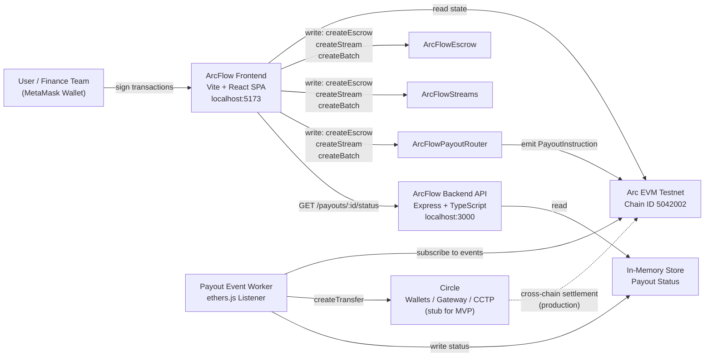

# ArcFlow Treasury

> Stablecoin treasury operations — escrow, payroll streams, and batch payouts on Arc.


---

## Description

ArcFlow Treasury is an Arc-native web application that gives finance and operations teams a single interface for stablecoin treasury workflows. It replaces fragmented spreadsheets, manual wallet operations, and ad-hoc escrow agreements with fully on-chain, auditable primitives — conditional escrows with dispute resolution, linear vesting streams with cliff support, and multi-recipient batch payouts — all denominated in USDC or EURC.

The system runs on **Arc**, a Layer-1 blockchain built by Circle for stablecoin-native finance. Arc provides sub-second finality, USDC-denominated gas, and predictable fees. For cross-chain settlement, the architecture routes through **Circle Wallets**, **Circle Gateway**, and **CCTP** so users never manage bridging or liquidity themselves.

**Target users:** Crypto-native companies and technical founders who pay contractors, run payroll, and execute bulk transfers in stablecoins.

---

## Table of Contents

- [Features](#features)
- [Tech Stack](#tech-stack)
- [Architecture Overview](#architecture-overview)
- [Installation](#installation)
- [Usage](#usage)
- [Configuration](#configuration)
- [Screenshots / Demo](#screenshots--demo)
- [API Reference](#api-reference)
- [Tests](#tests)
- [Roadmap](#roadmap)
- [Contributing](#contributing)
- [License](#license)
- [Contact / Support](#contact--support)

---

## Features

- **On-chain Escrow** — Lock USDC/EURC with configurable expiry, optional arbitrator, and automatic release. Either party can raise a dispute; the arbitrator resolves it on-chain.
- **Payroll & Vesting Streams** — Employer-funded linear vesting with a cliff period. Employees withdraw at any time; employers can revoke with an automatic pro-rata split.
- **Batch Payouts** — Create multi-recipient payout batches in a single transaction. Each recipient specifies a destination chain (`ARC`, `BASE`, `AVAX`, `ETH`, `ARB`) aligned to Circle's supported chain set.
- **My Escrows / Streams / Batches** — localStorage-persisted list views on each page. Created items appear instantly and survive page refresh; click any item to auto-load it.
- **Treasury Dashboard** — Real-time overview of USDC locked in escrows, streams, and pending payout batches, with Quick Actions and Recent Activity.
- **Backend Event Worker** — Subscribes to on-chain `PayoutInstruction` events and routes them to Circle's payout infrastructure (stub wired for production integration).
- **REST Status API** — Query payout batch and per-recipient status at any time without re-querying the chain.
- **MetaMask Integration** — One-click wallet connect with Arc Testnet chain detection and live API health indicator.
- **Glassmorphism UI** — Dark dashboard with skeleton loading, consistent empty/error/success states, and toast notifications throughout.

---

## Tech Stack

| Layer | Technology |
|---|---|
| Smart Contracts | Solidity 0.8.20, Hardhat 2.x, OpenZeppelin Contracts 5.x |
| Contract Testing | Hardhat + Chai + `@nomicfoundation/hardhat-chai-matchers` |
| Backend API | Node.js 18+, Express 4.x, TypeScript 5.x, ethers.js v6 |
| Backend Testing | Vitest 1.x |
| Logging | Winston 3.x |
| Frontend | Vite 7, React 18, TypeScript 5.x |
| Styling | Tailwind CSS 3.x + `@tailwindcss/forms` |
| Routing | react-router-dom v6 |
| Web3 | ethers.js v6 |
| Icons | lucide-react |
| Notifications | react-hot-toast |
| Network | Arc EVM Testnet — Chain ID `5042002` |
| Circle SDK (stub) | [`@circle-fin/developer-controlled-wallets`](https://github.com/circlefin/developer-controlled-wallets-sample-app) — Wallets API + Gateway / CCTP |
| Circle reference | [`circlefin/arc-multichain-wallet`](https://github.com/circlefin/arc-multichain-wallet) — chain names, domain IDs, and dual-endpoint routing |

---

## Architecture Overview



The **frontend** connects directly to Arc EVM via the user's injected wallet for all transaction signing and contract reads. The **backend worker** independently listens for `PayoutInstruction` events emitted by `ArcFlowPayoutRouter`, decodes each recipient's chain and amount, and calls the Circle API stub to initiate off-chain settlement. The **REST API** surfaces the worker's stored payout status so the frontend can poll without re-querying the chain.

### Circle integration alignment

The Circle client (`arcflow-backend/src/services/circleClient.ts`) is modelled directly on [`circlefin/arc-multichain-wallet`](https://github.com/circlefin/arc-multichain-wallet):

| What | Value adopted from arc-multichain-wallet |
|---|---|
| Chain identifiers | `ARC-TESTNET`, `BASE-SEPOLIA`, `AVAX-FUJI`, `ETH-SEPOLIA`, `ARB-SEPOLIA` |
| CCTP domain IDs | ARC-TESTNET=5, BASE-SEPOLIA=6, AVAX-FUJI=1, ETH-SEPOLIA=0, ARB-SEPOLIA=3 |
| Same-chain endpoint | Circle Wallets API — `api.circle.com/v1/transfers` |
| Cross-chain endpoint | Circle Gateway API — `gateway-api-testnet.circle.com/v1/transfer` |
| SDK | `@circle-fin/developer-controlled-wallets` (initialized with `apiKey` + `entitySecret`) |
| Method name | `createTransfer()` (maps to `circleClient.createTransfer` in the reference app) |

The current implementation is a **stub** — it logs the correct endpoint and returns a fake transfer ID. Switching to live payouts requires real credentials and replacing the stub body with actual HTTP calls + EIP-712 `BurnIntent` signing for the cross-chain path (see `arc-multichain-wallet/lib/circle/gateway-sdk.ts → transferGatewayBalanceWithEOA`).

---

## Installation

### Prerequisites

- **Node.js** 18 or later (`node --version`)
- **npm** 9 or later
- A wallet funded on Arc Testnet (get testnet USDC/EURC from [faucet.circle.com](https://faucet.circle.com/) — select **Arc Testnet**)

### 1. Clone the repository

```bash
git clone https://github.com/MasteraSnackin/ArcFlow-Treasury.git
cd ArcFlow-Treasury
```

### 2. Install contract dependencies (root)

```bash
npm install
```

### 3. Install backend dependencies

```bash
cd arcflow-backend && npm install && cd ..
```

### 4. Install frontend dependencies

```bash
cd arcflow-frontend && npm install && cd ..
```

### 5. Configure environment variables

```bash
cp .env.example .env
# Edit .env with your values — see Configuration section
```

### 6. Verify your setup

```bash
npm run verify-setup
```

---

## Usage

### Compile and deploy contracts

```bash
# Compile Solidity
npm run compile

# Deploy to Arc Testnet
npm run deploy:arc
```

The deploy script prints the addresses of `ArcFlowEscrow`, `ArcFlowStreams`, and `ArcFlowPayoutRouter`. Copy these into your `.env`.

### Start the backend

```bash
# Terminal 1 — API server (port 3000)
cd arcflow-backend
npm run dev:server

# Terminal 2 — Payout event worker (optional, for batch payout tracking)
cd arcflow-backend
npm run dev:worker
```

### Start the frontend

```bash
cd arcflow-frontend
npm run dev
# → http://localhost:5173
```

### End-to-end example: create an escrow

1. Open `http://localhost:5173` and click **Connect Wallet**.
2. Navigate to **Escrow & Disputes**.
3. Click **New Escrow** → fill in payee address, token (USDC/EURC), amount, expiry hours, and optional arbitrator.
4. Approve the ERC-20 spend when prompted, then confirm the `createEscrow` transaction.
5. The new escrow appears instantly in the **My Escrows** panel. Click it to auto-load details.
6. Use the lookup panel to raise disputes, auto-release after expiry, or resolve as arbitrator.

### End-to-end example: create a batch payout

1. Navigate to **Payout Batches** → click **New Batch Payout**.
2. Select token (USDC/EURC), add recipient rows (address, amount, destination chain).
3. Confirm the `createBatchPayout` transaction.
4. The batch appears in the **My Batches** panel. Click it to fetch live Circle payout status from the backend API.

---

## Configuration

All configuration is via environment variables in the **root `.env`** file.

| Variable | Required | Description |
|---|---|---|
| `ARC_TESTNET_RPC_URL` | Yes | JSON-RPC endpoint for Arc Testnet |
| `ARC_PRIVATE_KEY` | Yes | Deployer private key (`0x` + 64 hex chars) |
| `ARC_FEE_COLLECTOR` | Yes | Address that receives protocol fees |
| `ARC_FEE_BPS` | Yes | Fee in basis points — use `0` for no fee |
| `ARCFLOW_ESCROW_ADDRESS` | After deploy | Deployed `ArcFlowEscrow` address |
| `ARCFLOW_STREAMS_ADDRESS` | After deploy | Deployed `ArcFlowStreams` address |
| `ARCFLOW_PAYOUT_ROUTER_ADDRESS` | After deploy | Deployed `ArcFlowPayoutRouter` address |
| `CIRCLE_API_KEY` | Optional | Circle API key (production payout routing) |
| `CIRCLE_ENTITY_SECRET` | Optional | Circle entity secret (production payout routing) |
| `PORT` | Optional | Backend API port (default: `3000`) |

**Example `.env`:**

```env
ARC_TESTNET_RPC_URL=https://rpc.arc-testnet.example.com
ARC_PRIVATE_KEY=0xabc123...def456
ARC_FEE_COLLECTOR=0xYourFeeCollectorAddress
ARC_FEE_BPS=0
```

> **Never commit your `.env` file.** It is included in `.gitignore`.

---

## Screenshots / Demo

> No live deployment is available for this MVP. Run locally using the steps above.

| View | Description |
|---|---|
| **Dashboard** | 4-metric bento grid — USDC locked in escrow, locked in streams, pending batches, total obligations + Quick Actions |
| **Escrow & Disputes** | My Escrows list, lookup by ID, 2-step dispute confirmation, arbitrator resolve |
| **Payroll & Vesting** | My Streams list, vesting progress bar, cliff/end timeline, withdraw and 2-step revoke |
| **Payout Batches** | My Batches list, dynamic recipient grid with per-chain destination, batch status table with Circle transfer IDs |

```markdown


```

---

## API Reference

Base URL: `http://localhost:3000`

### `GET /status`

Returns backend health.

```bash
curl http://localhost:3000/status
```

```json
{ "status": "ok", "network": "arc-testnet" }
```

---

### `GET /payouts/:batchId/status`

Returns aggregated status for all recipients in a payout batch.

```bash
curl http://localhost:3000/payouts/1/status
```

```json
{
  "batchId": "1",
  "ready": true,
  "totalAmount": "5000.00",
  "payouts": [
    {
      "index": 0,
      "recipient": "0xabc...def",
      "amount": "2500.00",
      "destinationChain": "BASE",
      "status": "COMPLETED",
      "circleTransferId": "circle_transfer_1234_5678"
    }
  ]
}
```

---

### `GET /payouts/:batchId/:index/status`

Returns status for a single recipient within a batch.

```bash
curl http://localhost:3000/payouts/1/0/status
```

**Status values:** `QUEUED` · `COMPLETED` · `FAILED`

---

## Tests

### Smart contract tests — 31 tests

```bash
# From project root
npm test
```

Covers `ArcFlowEscrow`, `ArcFlowStreams`, and `ArcFlowPayoutRouter` using Hardhat + Chai matchers. Scenarios include happy paths, zero-address and zero-amount reverts, time-based auto-release, dispute resolution, stream vesting at 0%/50%/100%, revoke with pro-rata split, and large multi-recipient batches.

### Backend tests — 12 tests

```bash
cd arcflow-backend
npm test
```

Covers Circle client stub (`createTransfer`, `getTransferStatus`), chain identifier mapping (`ARC → ARC-TESTNET`, `BASE → BASE-SEPOLIA`, `AVAX → AVAX-FUJI`, `ETH → ETH-SEPOLIA`, `ARB → ARB-SEPOLIA`), CCTP domain ID lookups, `PayoutInstruction` event encoding/decoding, and Express route responses using Vitest.

### Type checking (all packages)

```bash
# Contracts
npx tsc --noEmit

# Backend
cd arcflow-backend && npx tsc --noEmit

# Frontend
cd arcflow-frontend && npx tsc --noEmit
```

---

## Roadmap

- [ ] Wire frontend to real contract calls via ethers.js (replace mock data)
- [x] My Escrows / My Streams / My Batches list views — localStorage-persisted, click-to-load
- [ ] Connect Circle Wallets / Gateway for real cross-chain payout routing (replace stub in `circleClient.createTransfer()`)
- [ ] Persist payout state to a database (replace in-memory store)
- [ ] Network mismatch detection — warn and prompt auto-switch to Arc Testnet
- [ ] Historical obligation charts on the dashboard
- [ ] Multi-organisation support (org switcher for teams managing multiple wallets)
- [ ] Fiat equivalent display (USDC → USD estimate via price oracle)
- [ ] Full EURC label propagation (amounts currently displayed in USDC label)
- [ ] Mainnet deployment guide and production security review

---

## Contributing

Contributions are welcome. Please follow these steps:

1. Fork the repository and create a branch from `main`.
2. Make your changes — ensure all tests pass (`npm test` at root, `npm test` in `arcflow-backend/`).
3. Run type checks across all packages before opening a PR.
4. Open a Pull Request with a clear description of what changed and why.
5. For bugs, open an issue first to align on the fix before submitting a PR.

**Please do not:**
- Hardcode secrets, RPC URLs, or private keys anywhere in source.
- Change smart contract behaviour without updating documentation and frontend expectations.
- Introduce breaking API changes without a migration note in the PR description.

---

## License

This project is licensed under the **MIT License**. See the [`LICENSE`](./LICENSE) file for details.

---

## Contact / Support

| | |
|---|---|
| **Issues / Bugs** | [Open an issue on GitHub](https://github.com/MasteraSnackin/ArcFlow-Treasury/issues) |
| **Repository** | [github.com/MasteraSnackin/ArcFlow-Treasury](https://github.com/MasteraSnackin/ArcFlow-Treasury) |
| **Maintainer** | `<ADD MAINTAINER NAME>` |
| **Email** | `<ADD CONTACT EMAIL>` |

> Built for the Arc + Circle hackathon.
> Arc Testnet block explorer: [testnet.arcscan.app](https://testnet.arcscan.app/)
> Testnet USDC/EURC faucet: [faucet.circle.com](https://faucet.circle.com/) → select **Arc Testnet**
