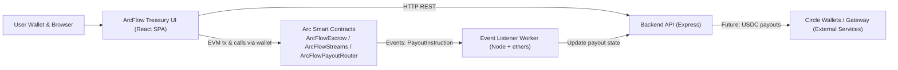
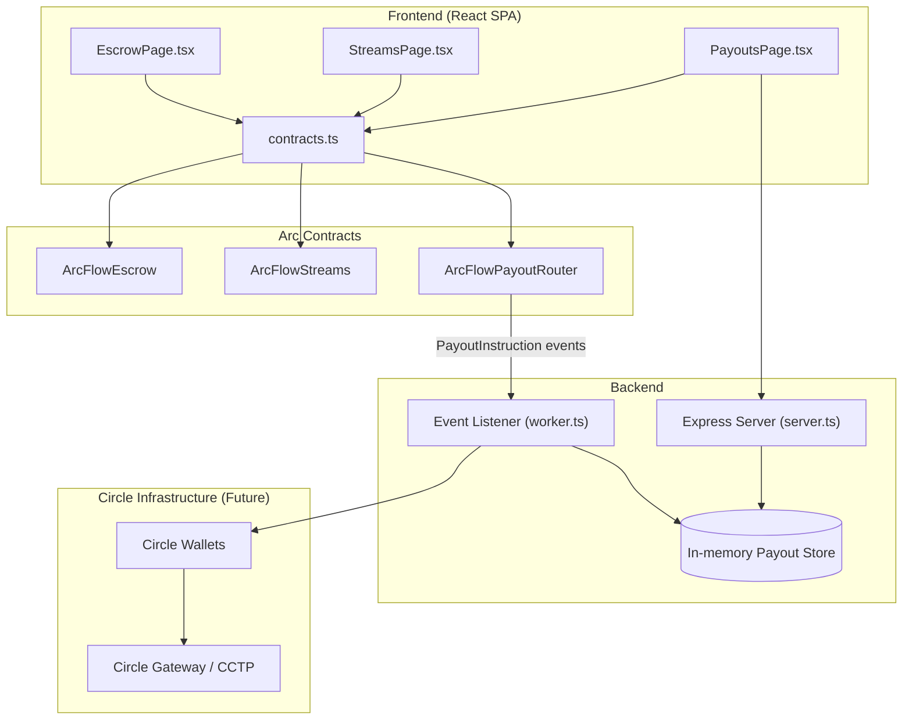
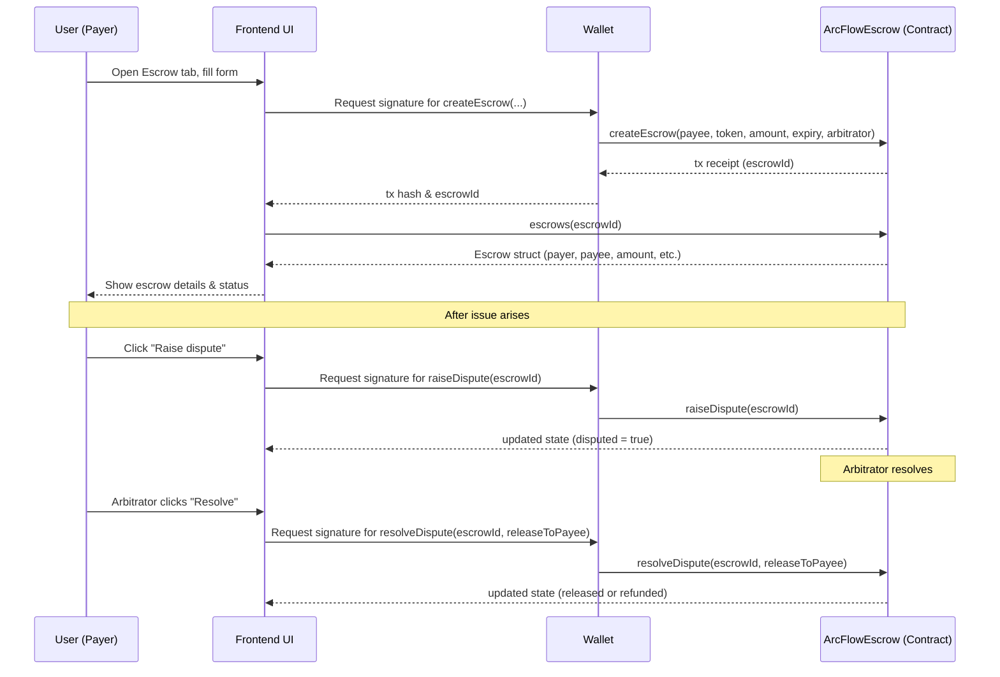
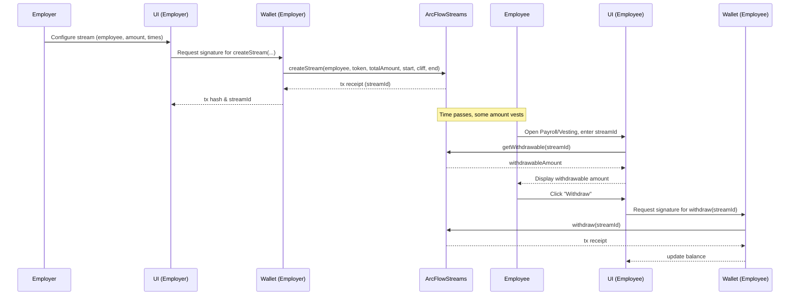
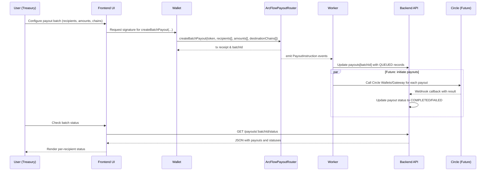
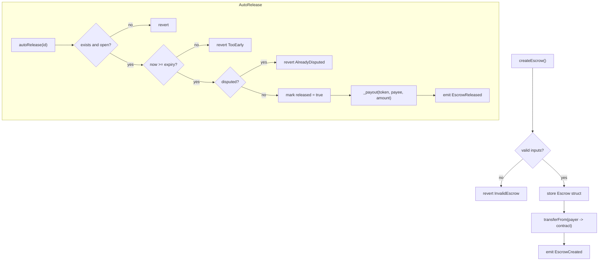
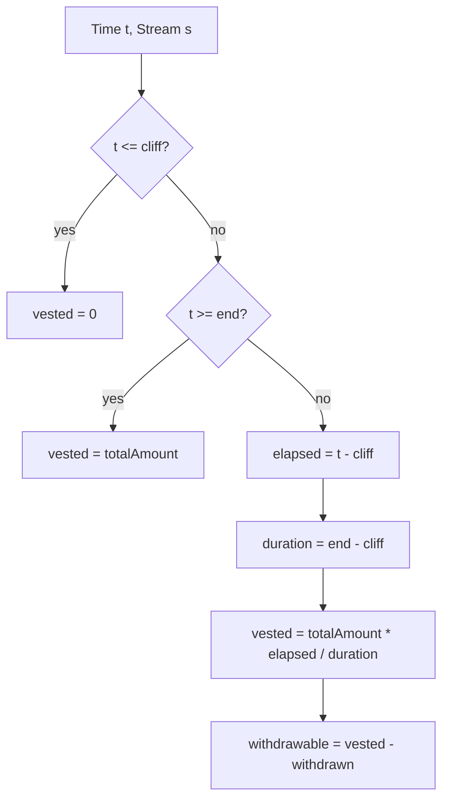

# ArcFlow Treasury – Architecture Diagrams

## 1. System Context / Container Diagram

## 2. Component-Level Diagram

## 3. Escrow Flow – Sequence Diagram

## 4. Vesting Stream Flow – Sequence Diagram

## 5. Payout Batch Flow – Sequence Diagram

## 6. Escrow Contract Internal Logic – Flowchart

## 7. Streams Vesting Logic – Flowchart

